CAE-CGAN
======================================================

This repository contains code accompanying the paper [Image Generation via Latent Space Learning Using Improved Combination](https://doi.org/10.1016/j.neucom.2019.02.031).

The code is tested on Linux operating system with Python 2.7 or 3.x, TensorFlow 1.4.0+.

Run the model using this command:
-------------------------------------

if you want to train unsupervised version:

	python main.py --gan_type AE_GAN --dataset mnist

supervised version:
	
	python main.py --gan_type CAE_CGAN --dataset mnist

The dataset you can choose mnist or fashion-mnist.You should put the dataset in the data folder.

```
├── data
│   ├── mnist # mnist data (not included in this repo)
│   |   ├── t10k-images-idx3-ubyte.gz
│   |   ├── t10k-labels-idx1-ubyte.gz
│   |   ├── train-images-idx3-ubyte.gz
│   |   └── train-labels-idx1-ubyte.gz
│   └── fashion-mnist # fashion-mnist data (not included in this repo)
│       ├── t10k-images-idx3-ubyte.gz
│       ├── t10k-labels-idx1-ubyte.gz
│       ├── train-images-idx3-ubyte.gz
│       └── train-labels-idx1-ubyte.gz
└── 
```

If you want to try more dataset you can contact me or modify by detail structure.

#### Our model trains the results on the MNIST dataset.
*Name* | *Epoch 1* | *Epoch 10* | *Epoch 25* | GIF |
:---: | :---: | :---: | :---: | :---: |
AE-GAN |  |  | 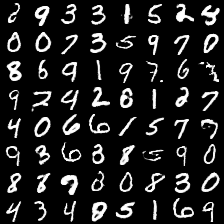 | 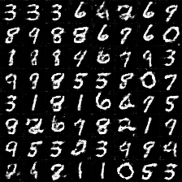
CAE-CGAN |  |  | 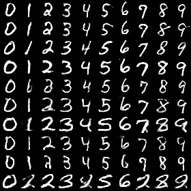 | 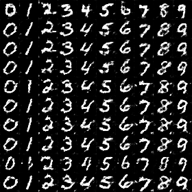

#### Our model trains the results on the fashion-MNIST dataset.
*Name* | *Epoch 1* | *Epoch 10* | *Epoch 25* | GIF |
:---: | :---: | :---: | :---: | :---: |
AE-GAN |  |  | 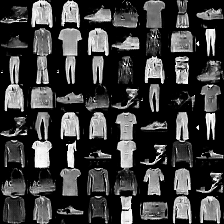 | 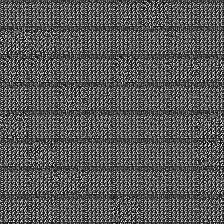
CAE-CGAN |  |  | 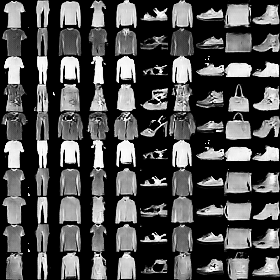 | 

#### Our model trains the results on the CIFAR-10 dataset. For CAE-CGAN we choose ship class to show.
*Name* | *Epoch 1* | *Epoch 20* | *Epoch 50* |  *Epoch 100* |
:---: | :---: | :---: | :---: | :---: |
AE-GAN |  |  | 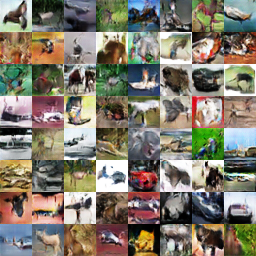 | 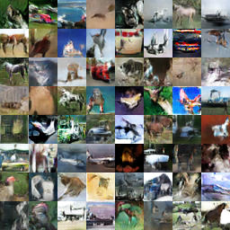
CAE-CGAN |  |  | 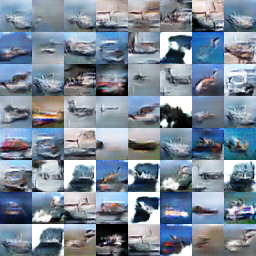 | 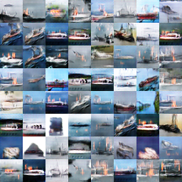

#### Our model trains the results on the celebA dataset.
*Name* | *Black_Hair* | *Blond_Hair* 
:---: | :---: | :---: |
CAE-CGAN | 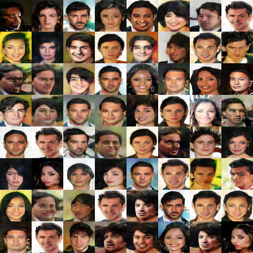 | 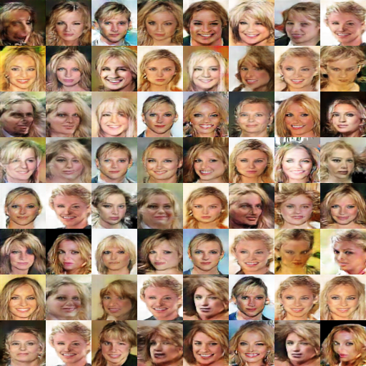
*Name* | *Brown_Hair* | *Gray_Hair* 
CAE-CGAN | 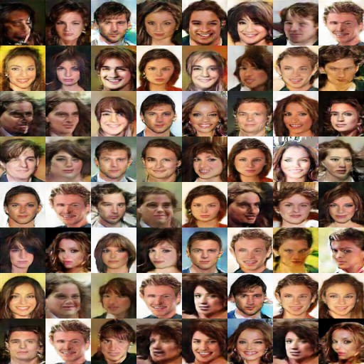 | 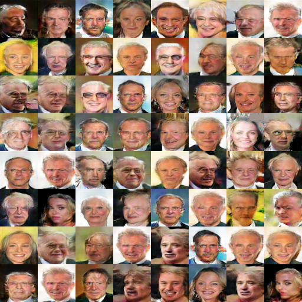

####  Prediction of the faces of the same person with different ages, each row corresponding to the same person.
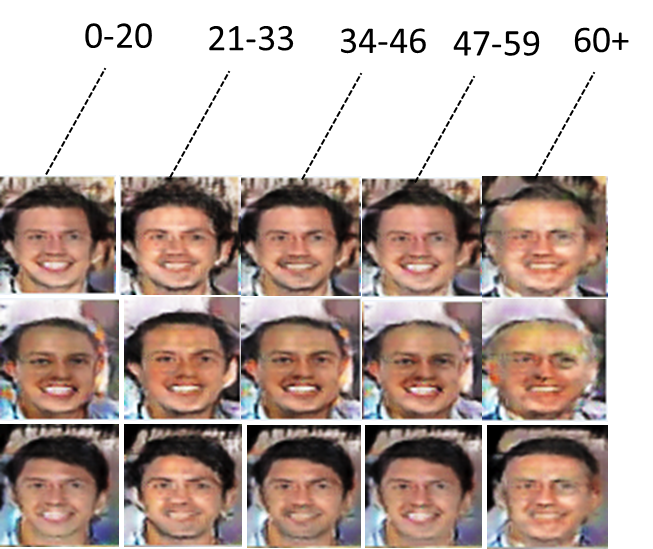

####  Facial attributes generation.
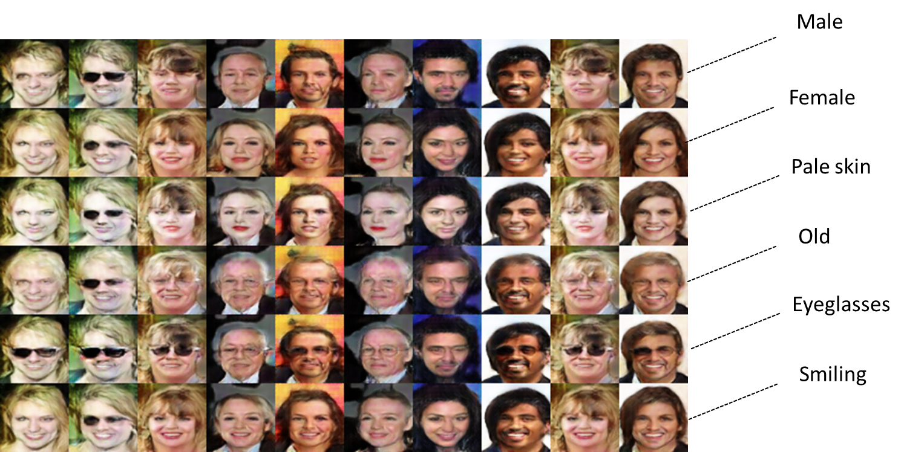

#### Other dataset network structure.

<p align="center">
    
</p>

<p align="center">
    
</p>

email: twistedwg@hotmail.com


