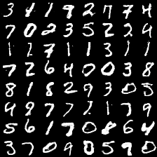
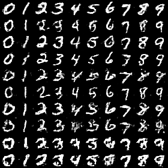
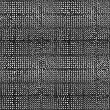
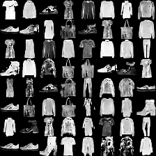
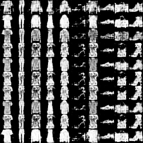
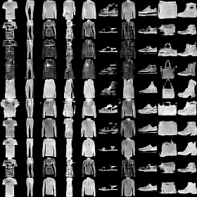
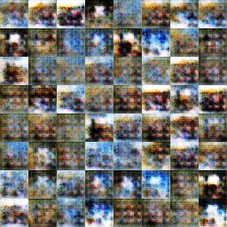
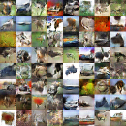
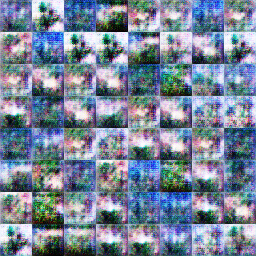
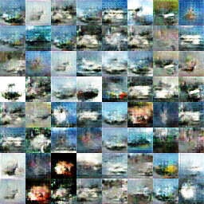

CAE-CGAN
======================================================

The code is tested on Linux operating system with Python 2.7 or 3.x, TensorFlow 1.4.0.

#### Our model trains the results on the MNIST dataset.
*Name* | *Epoch 1* | *Epoch 10* | *Epoch 25* | GIF |
:---: | :---: | :---: | :---: | :---: |
AE-GAN |  |  | img src = 'assets/AE-GAN/mnist/25.png' height = '200px'> | img src = 'assets/AE-GAN/mnist/mnist.gif' height = '200px'>
CAE-CGAN |  |  | img src = 'assets/CAE-CGAN/mnist/25.png' height = '200px'> | img src = 'assets/CAE-CGAN/mnist/mnist.gif' height = '200px'>

#### Our model trains the results on the fashion-MNIST dataset.
*Name* | *Epoch 1* | *Epoch 10* | *Epoch 25* | GIF |
:---: | :---: | :---: | :---: | :---: |
AE-GAN |  |  | img src = 'assets/AE-GAN/fashion-mnist/25.png' height = '200px'> | img src = 'assets/AE-GAN/fashion-mnist/mnist.gif' height = '200px'>
CAE-CGAN |  |  | img src = 'assets/CAE-CGAN/fashion-mnist/25.png' height = '200px'> | img src = 'assets/CAE-CGAN/fashion-mnist/mnist.png' height = '200px'>

#### Our model trains the results on the CIFAR-10 dataset. For CAE-CGAN we choose ship class to show.
*Name* | *Epoch 1* | *Epoch 20* | *Epoch 50* |  *Epoch 100* |
:---: | :---: | :---: | :---: | :---: |
AE-GAN |  |  | img src = 'assets/AE-GAN/cifar10/50.png' height = '200px'> | img src = 'assets/AE-GAN/cifar10/100.png' height = '200px'>
CAE-CGAN |  |  | img src = 'assets/CAE-CGAN/cifar10/50.png' height = '200px'> | img src = 'assets/CAE-CGAN/cifar10/100.png' height = '200px'>

author: WuGuang

email: twistedwg@hotmail.com

